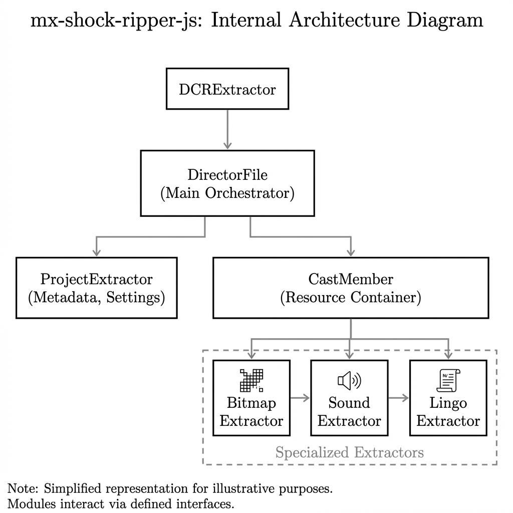
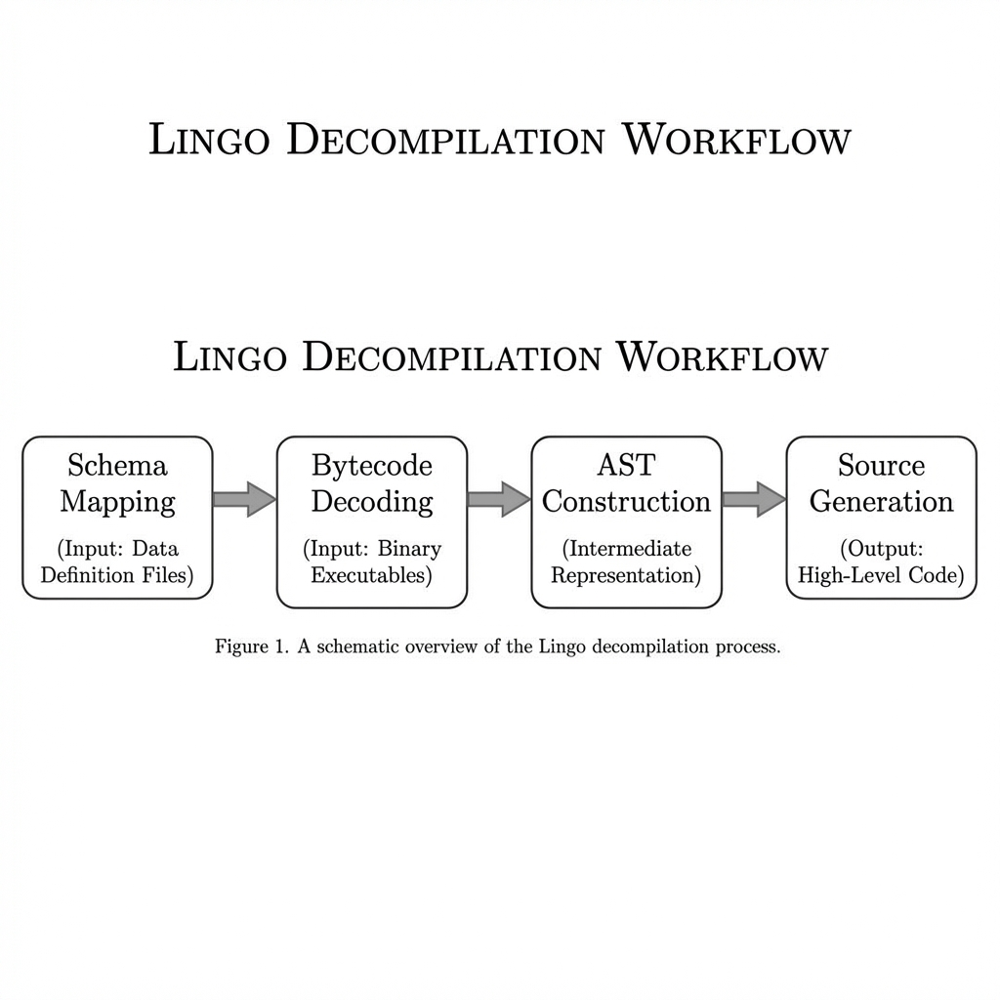

# mx-shock-ripper-js


A high-performance library and CLI toolset for the **extraction**, **analysis**, and **reconstruction** of legacy Adobe Director MX 2004 assets. This project provides a robust framework for converting packed binary archives (`.dcr`, `.cct`, `.cast`) into standard modern formats like PNG, WAV, and SVG.


*Figure 1: Internal technical architecture of the mx-shock-ripper-js library.*

## 🚀 Key Features

- **Multi-Phase Decompilation**: Recovers Lingo source code from obfuscated bytecode using advanced control flow analysis and stack-based AST generation.
- **Universal Asset Extraction**: Supports Bitmaps (PNG), Sounds (WAV/MP3), Palettes (PAL/JSON), Text (UTF-8), Shapes (SVG), and Fonts.
- **Complex Project Mapping**: Automatically resolves external cast library linkages and reconstructs the extraction hierarchy.
- **Academic Precision**: Implemented using a rigorous stack machine model to ensure high-fidelity source recovery.
- **Modern Pipeline**: Built on Node.js with efficient memory handling for large project files.

## 🛠 Technical Foundation

The library is designed around a decoupled architecture that separates low-level binary parsing from high-level asset extraction logic.

### Decompilation Workflow

The reconstruction of Lingo source code follows a rigorous four-phase process:

1. **Schema Mapping**: Identifies the internal Director version (V4 through V93) and maps internal segments.
2. **Bytecode Decoding**: Translates variable-length numeric opcodes into mnemonics.
3. **AST Construction**: Uses a stack machine model to build an Abstract Syntax Tree, reconstructing control flows (`if/else`, `loops`, `cases`).
4. **Source Generation**: Emits formatted Lingo code based on the AST structure.


*Figure 2: Schematic representation of the multi-phase Lingo decompilation process.*

## 📈 Project Status

### Accomplished Tasks
- [x] Multi-threaded (recursive) project extraction for `.dcr` and `.cct`.
- [x] Robust Bitmap extraction with palette resolution and alpha reconstruction.
- [x] Advanced Lingo decompilation foundation with AST support.
- [x] Standardized CLI output and logging (Production 1.1.7 grade).
- [x] Comprehensive technical documentation and architecture diagrams.

### Pending / Known Issues
- **Palette-Member Association**: Some complex projects may require manual palette linkage correction in metadata.
- **Lingo Edge Cases**: Certain obfuscation patterns might result in minor syntax inaccuracies.
- **Shape Reconstruction**: Vector shape data parsing is currently experimental.

## 📦 Installation

```bash
npm install mx-shock-ripper-js
```

## ⌨️ Usage

### CLI Tool
The library includes a universal CLI (`mx-rip`) for rapid extraction.

#### Command Help
mx-shock-ripper-js - Production Grade Director Asset Ripper v1.2.0

Usage:
  mx-rip <input_file> [output_dir] [options]

Options:
  --bitmap    Extract PNG images
  --script    Decompile Lingo scripts (.ls)
  --sound     Extract WAV/MP3 audio
  --palette   Extract palette JSONs
  --shape     Generate SVG for vector shapes
  --vector    Generate SVG for Vector Shapes (Type 18)
  --filmloop  Extract FilmLoop data (JSON)
  --text      Extract text members (RTF)
  --field     Extract field members
  --font      Extract font binary chunks (TTF/OTF detection)
  --xtra      Extract Xtra binary blobs
  --lasm      Generate Lingo assembly files (.lasm)
  --colored   Attempt bitmap colorization (requires palette discovery)
  --force     Overwrite existing output directories
  --help      Show this help message

Example:
  mx-rip intro.dcr ./output --bitmap --script --colored
```

### Library Usage
Integrate the extraction logic directly into your Node.js application:

```javascript
const { DCRExtractor } = require('mx-shock-ripper-js');

async function rip() {
    const extractor = new DCRExtractor('project.dcr', './output', {
        bitmap: true,
        script: true,
        colored: true
    });
    await extractor.extract();
}
```

## 📖 Documentation

For detailed technical specifications, refer to the individual documentation modules:

- [Overview](docs/doc/01_Overview.md)
- [File Formats](docs/doc/02_FileFormats.md)
- [Extraction Process](docs/doc/03_ExtractionProcess.md)
- [Cast Members](docs/doc/04_CastMembers.md)
- [Lingo Decompiler](docs/doc/05_LingoDecompiler.md)
- [Bitmap Extraction](docs/doc/06_BitmapExtraction.md)
- [Sound Extraction](docs/doc/07_SoundExtraction.md)
- [Lingo AST](docs/doc/08_LingoAST.md)
- [Palette Extraction](docs/doc/09_PaletteExtraction.md)
- [Shape Extraction](docs/doc/10_ShapeExtraction.md)
- [Vector Extraction](docs/doc/11_VectorExtraction.md)

## 💰 Donation

If you find this project useful, consider supporting its development.
**PayPal**: [@lukasharinggarcia](https://www.paypal.me/lukasharinggarcia)

## 🤝 Acknowledgments

This project uses [ProjectorRays](https://github.com/ProjectorRays/ProjectorRays) as a primary technical reference for Director binary specifications and Lingo bytecode mapping.

## 📄 License

This project is licensed under the MIT License.
