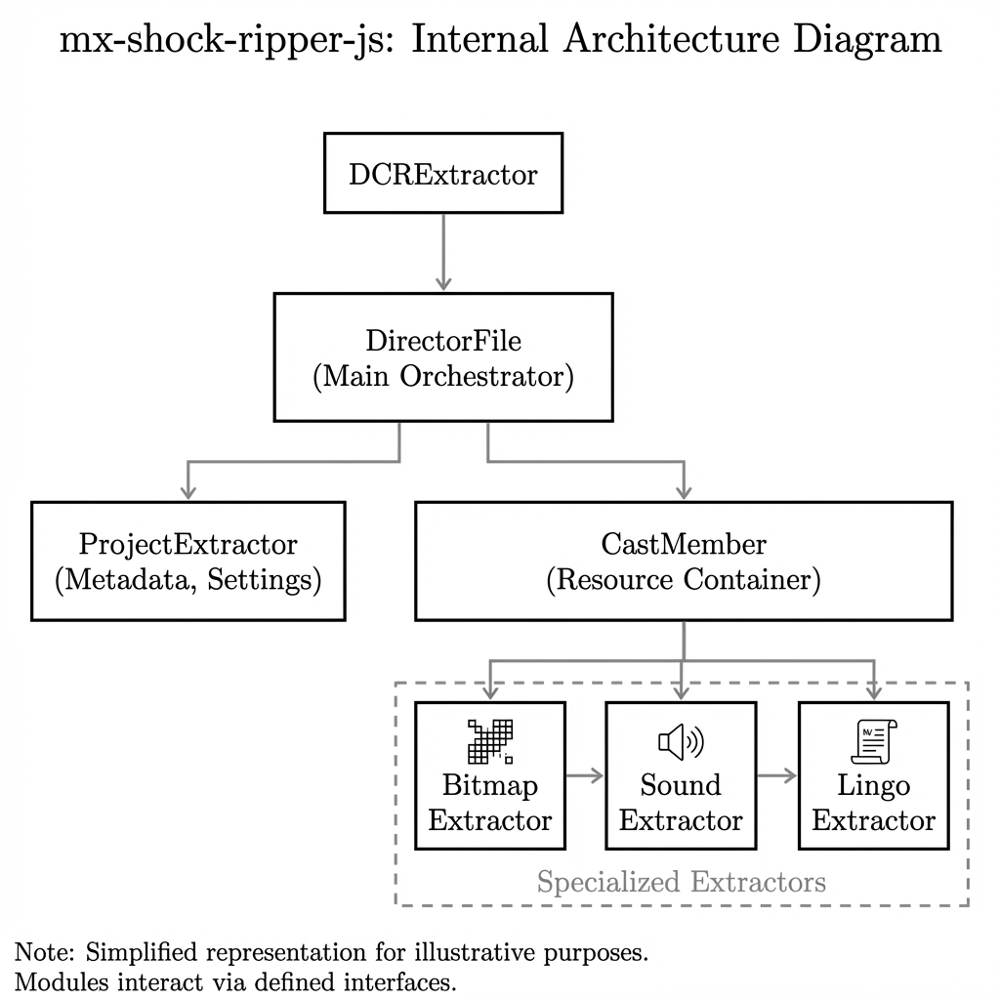

# mx-shock-ripper-js


`mx-shock-ripper-js` is a Node.js extractor for Adobe Director / Shockwave assets. It parses standard and Afterburned RIFX containers, resolves cast-member metadata, and writes recovered assets from `.dcr`, `.cct`, and `.cst` files to modern formats.


*Figure 1: High-level extractor architecture.*

## What It Does

- Extracts bitmaps to `.png`, with palette and alpha handling.
- Decompiles Lingo scripts to `.ls` and optionally `.lasm`.
- Extracts sounds, text, fields, shapes, palettes, fonts, Xtras, and generic binary fallbacks.
- Resolves linked project casts for `.dcr` movies through `MCsL`.
- Handles protected / Afterburned chunk tags and inline ILS-resident resources.
- Writes a `members.json` manifest with per-member output metadata, explicit discovery/selection/extraction stats, and per-member extraction outcomes.

## Installation

```bash
npm install mx-shock-ripper-js
```

## CLI Usage

```text
mx-shock-ripper-js - Production Grade Director Asset Ripper v1.5.5

Usage:
  mx-rip <input_file> [output_dir] [options]

Options:
  --bitmap    Extract PNG images
  --script    Decompile Lingo scripts (.ls)
  --sound     Extract WAV/MP3 audio
  --palette   Extract palettes (.pal)
  --shape     Extract QuickDraw shapes and vector-shape raw payloads
  --text      Extract text members
  --field     Extract field members
  --font      Extract font binary chunks
  --xtra      Extract Xtra binary blobs
  --lasm      Generate Lingo assembly files (.lasm)
  --colored   Attempt bitmap colorization
  --verbose   Print detailed worker diagnostics, per-member skips, and progress
  --force     Overwrite existing output directories
  --help      Show this help message
```

Examples:

```bash
mx-rip main.dcr ./output --bitmap --script --colored
mx-rip furniture.cst ./output --bitmap --palette --force
```

If no extraction-type flags are supplied, the CLI enables the supported extractors by default and leaves `--colored` off.

## Library Usage

```javascript
const { DCRExtractor, CCTExtractor } = require('mx-shock-ripper-js');

async function extractMovie() {
  const extractor = new DCRExtractor('main.dcr', './output', {
    bitmap: true,
    script: true,
    colored: true
  });

  await extractor.extract();
}

async function extractCast() {
  const extractor = new CCTExtractor('furniture.cst', './output', {
    bitmap: true,
    palette: true
  });

  await extractor.extract();
}
```

## Output Layout

Typical outputs include:

- `members.json`: extraction manifest and stats.
- `movie.json`: movie-wide metadata such as stage config.
- `timeline.json`: extracted score/timeline metadata when present.
- `castlibs.json`: linked cast metadata for movie projects.
- `<input>_extraction.log`: extractor run log. Normal mode keeps it summarized; `--verbose` adds detailed worker diagnostics.

Per-member artifact references are stored in `members.json` under type-appropriate fields such as `image`, `scriptFile`, `paletteFile`, `textFile`, `soundFile`, and `dataFile`. Each member may also carry an `outcome` such as `extracted`, `unchanged`, `placeholder_source`, or `unsupported_content`.

## Current Limitations

- Some bitmap members still produce `unsupported_content` or generic binary output when the payload exists but the extractor cannot yet decode it to a richer format.
- Metadata-only placeholder members and external asset references are classified clearly, but they are not yet reconstructed automatically from linked or neighboring casts.
- Lingo decompilation is serviceable for many Director 4-8.5 patterns, but some object-call and variable-recovery edge cases remain.

## Documentation

- [Overview](docs/doc/01_Overview.md)
- [File Formats](docs/doc/02_FileFormats.md)
- [Extraction Process](docs/doc/03_ExtractionProcess.md)
- [Cast Members](docs/doc/04_CastMembers.md)
- [Lingo Decompiler](docs/doc/05_LingoDecompiler.md)
- [Bitmap Extraction](docs/doc/06_BitmapExtraction.md)
- [Sound Extraction](docs/doc/07_SoundExtraction.md)
- [Lingo AST](docs/doc/08_LingoAST.md)
- [Palette Extraction](docs/doc/09_PaletteExtraction.md)
- [Shape Extraction](docs/doc/10_ShapeExtraction.md)
- [Vector Extraction](docs/doc/11_VectorExtraction.md)
- [Output Manifest](docs/doc/12_OutputManifest.md)
- [Text and Field Extraction](docs/doc/13_TextAndFieldExtraction.md)
- [FilmLoop and Movie Members](docs/doc/14_FilmLoopAndMovieMembers.md)
- [Font Extraction](docs/doc/15_FontExtraction.md)
- [Digital Video Extraction](docs/doc/16_DigitalVideoExtraction.md)
- [Flash Extraction](docs/doc/17_FlashExtraction.md)
- [Xtra Extraction](docs/doc/18_XtraExtraction.md)
- [Generic and Metadata-Only Members](docs/doc/19_GenericAndMetadataOnlyMembers.md)

## Acknowledgments

[ProjectorRays](https://github.com/ProjectorRays/ProjectorRays) and [ScummVM](https://www.scummvm.org/) are the main technical references for Director container behavior, resource layouts, and Lingo bytecode semantics.

## Donation

**PayPal**: [@lukasharinggarcia](https://www.paypal.me/lukasharinggarcia)

## License

This project is licensed under the MIT License.
